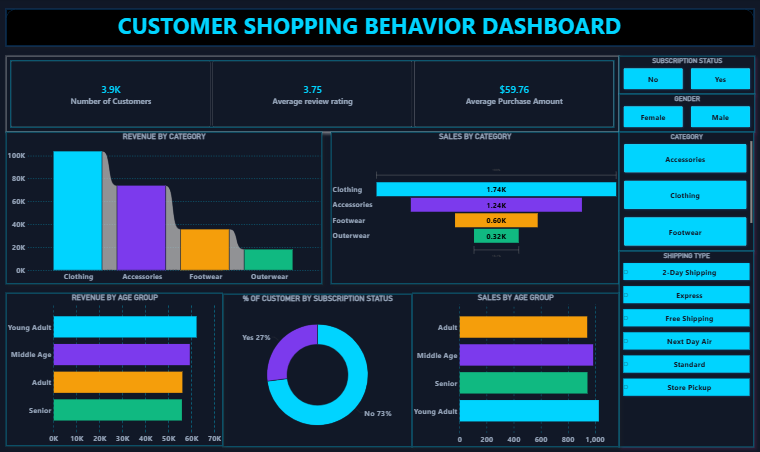

# 🛍️ Customer Behavior Analytics — End-to-End Cloud Data Pipeline
Python · Neon PostgreSQL · SQL · Power BI

---

## 📌 Overview

Most customer analytics projects stop at the spreadsheet. This one goes further — raw data gets cleaned in Python, loaded into a cloud PostgreSQL database, queried with 10 business intelligence queries, and visualized in an interactive Power BI dashboard.

The dataset covers 3,900 customer records across 25 products, 4 categories, and all 50 U.S. states, with $233K in total revenue.

**Tech stack:**
- Python (Pandas, SQLAlchemy) — data cleaning, feature engineering, ETL
- Neon.com — serverless PostgreSQL cloud database
- Google Colab — development environment
- SQL — CTEs, window functions, case statements, data segmentation
- Power BI — interactive executive dashboard

---

## 🏗️ How it works
```
Raw Dataset (3,900 records | 18 features)
        ↓
Python (Data Cleaning + Feature Engineering)
        ↓
Neon Serverless PostgreSQL (Cloud Data Warehouse)
        ↓
SQL (10 Business Intelligence Queries)
        ↓
Power BI (Interactive Dashboard)
```

---

## 📊 Dataset

| Metric | Value |
|--------|-------|
| Total customers | 3,900 |
| Total revenue | $233,081 |
| Avg purchase amount | $59.76 |
| Avg review rating | 3.71 / 5.0 |
| Unique products | 25 |
| Product categories | 4 (Clothing, Accessories, Footwear, Outerwear) |
| U.S. states covered | 50 |
| Payment methods | 6 |
| Seasons covered | 4 (Spring, Summer, Fall, Winter) |
| Discount applied | 1,677 customers (43.0%) |
| Subscribed customers | 1,053 (27.0%) |

---

## ⚙️ Pipeline

**🔹 1. Data engineering & ETL (Python)**
- Handled missing values and standardized schema for SQL ingestion
- Prepared dataset for relational cloud storage
- Connected Google Colab directly to Neon Serverless PostgreSQL — no local server required

**🔹 2. Cloud data warehousing (SQL)**

10 business questions answered on the cloud-hosted database:

| Query | Technique | Finding |
|-------|-----------|---------|
| Revenue by gender | GROUP BY + SUM | Male: $157,890 vs Female: $75,191 |
| Discount vs high spenders | Subquery | 1,677 customers (43%) used discounts |
| Top 5 rated products | AVG + ORDER BY | Top products ranked by avg rating |
| Shipping type comparison | GROUP BY + AVG | Express $60.48 vs Standard $58.46 |
| Subscriber spend analysis | GROUP BY + COUNT | 1,053 subscribers vs 2,847 non-subscribers |
| Discount rate by product | CASE + ROUND | Top 5 discount-heavy products identified |
| Customer segmentation | CTE + CASE | New (83) / Returning (701) / Loyal (3,116) |
| Top 3 products per category | CTE + ROW_NUMBER | Window function ranking across 4 categories |
| Repeat buyer subscription | WHERE + GROUP BY | 89.1% of customers are repeat buyers |
| Revenue by age group | GROUP BY + SUM | Age-based revenue distribution mapped |

**🔹 3. Business intelligence (Power BI)**

Connected Neon Cloud DB directly to Power BI:
- Executive KPIs: total revenue, avg rating, subscription rate, avg purchase
- Operational views: shipping efficiency, regional sales, category performance

---

## 📈 Key findings

| Finding | Numbers | Note |
|---------|---------|------|
| Top revenue category | Clothing — $104,264 (44.7%) | Nearly half of all revenue |
| Customer loyalty | 3,116 loyal customers (79.9%) | Strong retention base |
| Gender revenue gap | Male $157,890 vs Female $75,191 | Female segment is underdeveloped |
| Shipping cost gap | Express vs Standard — $2.02 difference | Customers choose speed, not savings |
| Subscription revenue | Non-subscribers drive $170,436 (73.1%) | Subscription value needs work |
| Discount usage | 43% of customers used discounts | Worth re-evaluating discount structure |
| Repeat buyers | 89.1% repeat purchase rate | High loyalty across the board |

---

## 📂 File structure
```
Customer-Behavior-Analytics/
├── customer_behavior.ipynb
├── customer_behavior.sql
├── customer_behavior_dashboard1.pbix
├── customer_shopping_behavior.csv
└── Customer_Shopping_Behavior_Dashboard.png
```

---

## 🚀 How to run

1. Run `customer_behavior.ipynb` to walk through the ETL process and Neon PostgreSQL connection
2. Import `customer_behavior.sql` into any PostgreSQL environment to run the queries
3. Open `customer_behavior_dashboard.pbix` in Power BI Desktop to explore the dashboard

---

## 📸 Dashboard preview



---

## 🎯 Conclusions

The repeat buyer rate (89.1%) is the number that stands out most. Nearly 9 in 10 customers came back, which means the retention side of the business is solid. The problem is monetization — 73.1% of revenue comes from non-subscribers, which suggests the subscription offering isn't compelling enough to convert people who are already loyal.

The gender revenue gap is also worth noting. Male customers generated $157,890 against $75,191 from female customers. That's not necessarily a targeting failure — it could reflect product mix — but Clothing already drives 44.7% of revenue, which skews things.

The shipping finding is small but interesting. Express and Standard shipping differ by just $2.02 in average purchase value. Customers who pay for faster shipping aren't spending more, they just want the order sooner.
